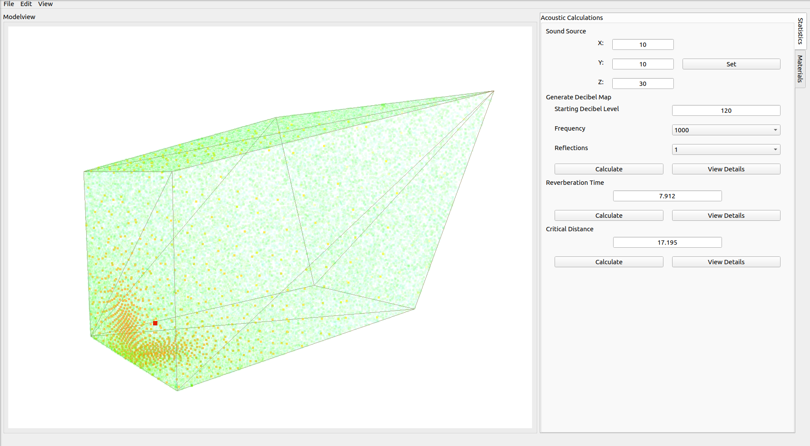

# dB-mapper

dB-mapper is a Qt5 application that utilizes Python 3 and OpenGL to determine the acoustic properties of 3D models. It uses ray tracing to generate a decibel map of models and can test the inclusion of different building materials and their effects on the acoustics of the model.

## Installation and Running the Application

1. Ensure that you have Pyhton3.7.X installed on your system.
2. In the root folder of the repository, run `python3 -m venv .env` to create a virtual environment.
3. Run `source .env/bin/activate` to activate the virtual environment.
4. Having `wheel` is recomended. (`pip install wheel`)
5. Once in the virtual environment, run `pip install -r requirements.txt` to install dependencies.
6. Run `python app.py` to start the application.